# Sınırdayım

**Tır şoförleri ve nakliyeciler için sınır kapısı sıra takibi ve takografa uygun sefer planlama.**

Sınırdayım, kara sınır kapılarındaki tır kuyruğunu, tahmini bekleme süresini ve kuyruğun saatler içinde nasıl
değişeceğini gösterir. Resmi kaynaklardan gelen veriyi şoförlerin anlık bildirimleriyle birleştirir. Rota
planlayıcısı ise takograf kurallarına (AB 561/2006, AETR) göre molaları gerçek dinlenme tesislerine yerleştirir,
sınır beklemelerini ve RSS randevusunu plana katar.

> Örnek: Samsun'daki bir şoför, Sarp kapısında şu an kaç tır olduğunu, kuyruğun büyüyüp büyümediğini, kapıya
> hangi saatte varırsa ne kadar bekleyeceğini ve son saatlerde geçen şoförlerin gerçekte ne kadar beklediğini görür.

Android ve iOS için tek kod tabanı (Kotlin / Compose Multiplatform), arka uç Go.

---

## İçindekiler

- [Ekranlar](#ekranlar)
- [Özellikler](#özellikler)
- [Veri kaynakları](#veri-kaynakları)
- [Tahmin nasıl yapılıyor](#tahmin-nasıl-yapılıyor)
- [Takograf kuralları](#takograf-kuralları)
- [Mimari](#mimari)
- [Kurulum ve çalıştırma](#kurulum-ve-çalıştırma)
- [API](#api)
- [Proje yapısı](#proje-yapısı)
- [Bilinen sınırlar](#bilinen-sınırlar)
- [Yol haritası](#yol-haritası)
- [Lisans](#lisans)

---

## Ekranlar

### Sınır kapıları

| Liste | Harita | Haritada kapı |
|:---:|:---:|:---:|
| 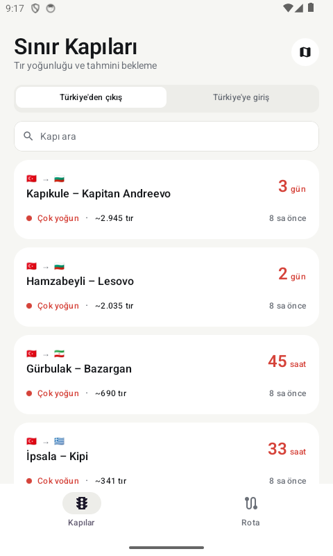 | 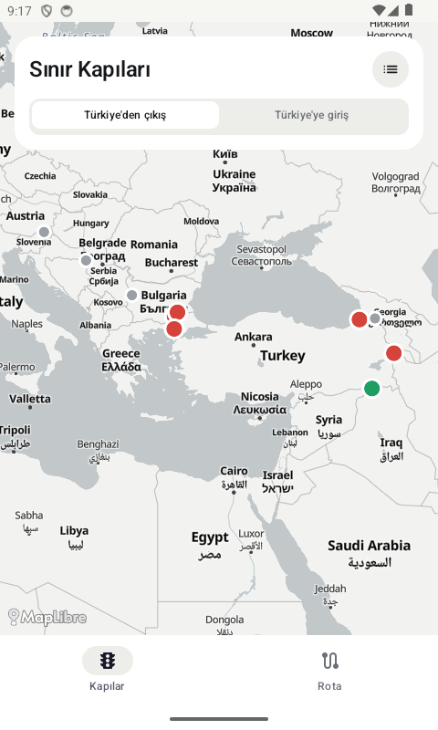 | 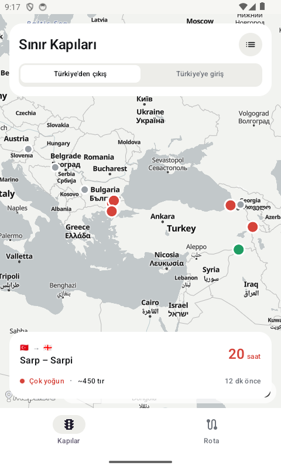 |
| Kapılar en uzun beklemeden başlayarak sıralanır; çıkış ve giriş yönü ayrı. | Kapılar yoğunluk rengiyle: kırmızı çok yoğun, turuncu yoğun, yeşil akıcı, gri veri yok. | Kapıya dokununca özet kartı açılır. |

### Sıra durumu

| Kapı detayı | Saat saat bekleme | Sıra durumu ve bildirimler | Bildir |
|:---:|:---:|:---:|:---:|
| 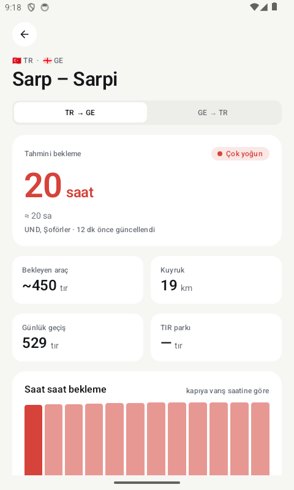 | 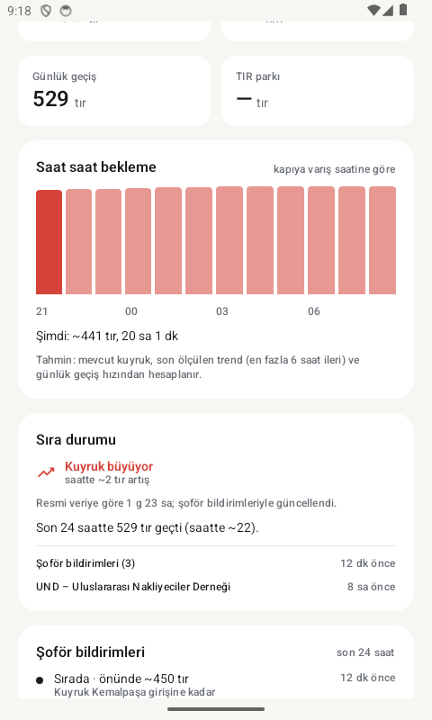 | 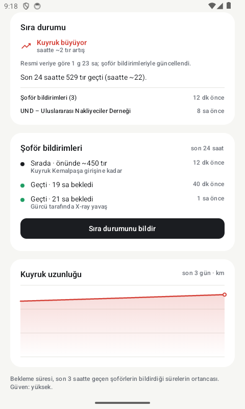 | 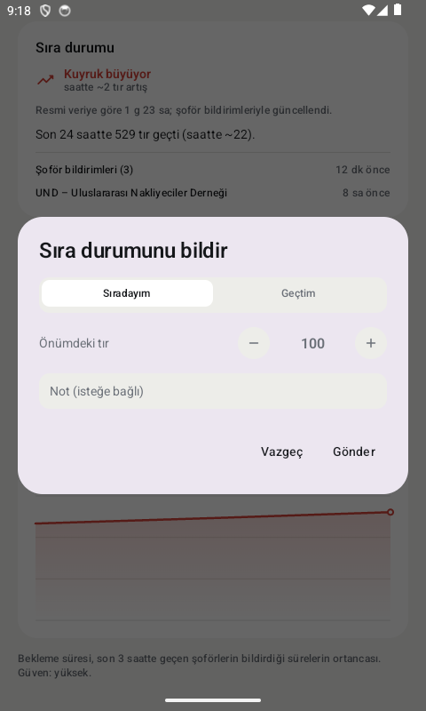 |
| Tahmini bekleme, bekleyen tır, kuyruk uzunluğu, günlük geçiş, TIR parkı. | Önümüzdeki 12 saat için kapıya varış saatine göre beklenen süre; en kısa saat vurgulanır. | Kuyruk trendi, resmi tahmin ile şoför bildirimli tahmin, kaynakların yaşı, son 24 saatin bildirimleri. | "Sıradayım, önümde N tır" ya da "Geçtim, X saat bekledim". |

### Rota planlama

| Form | Sonuç | Güzergâh seçenekleri | Sefer planı |
|:---:|:---:|:---:|:---:|
| 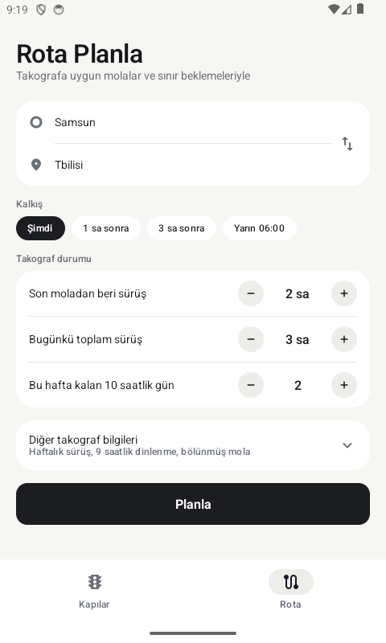 | 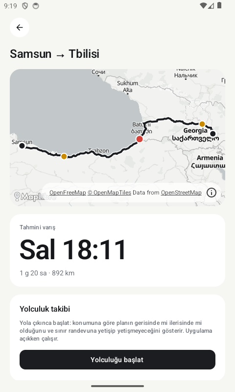 | 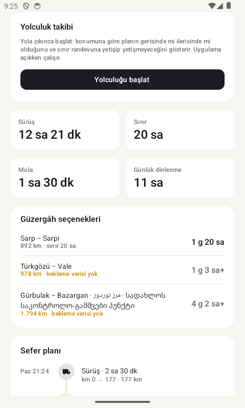 | 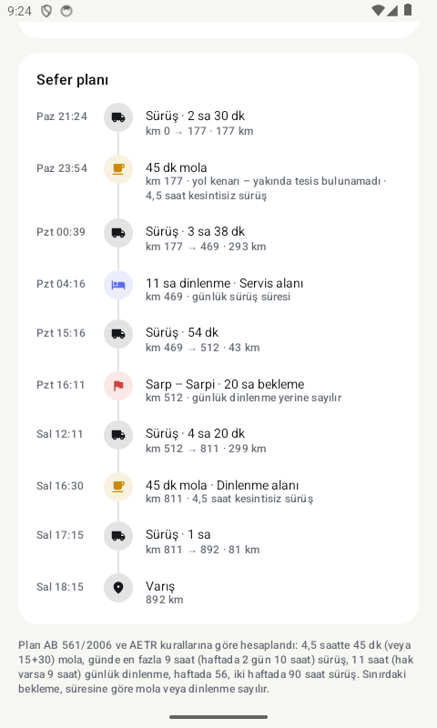 |
| Nereden, nereye, kalkış ve takograf durumu (açılır bölümde haftalık sürüş, 9 saatlik dinlenme hakkı, bölünmüş mola). | Tır rotası haritada; kapı kırmızı, molalar turuncu, dinlenmeler mavi. | Aday kapılar üzerinden alternatifler; bekleme verisi olmayanlar "+" ile işaretli. | Her sürüş, mola, dinlenme ve sınır beklemesi saatiyle; molalar gerçek tesislere yerleşir. |

### Sınır randevusu ve yolculuk takibi

| RSS randevu önerisi | Randevu seçimi | Randevuya göre plan | Yolculuk takibi |
|:---:|:---:|:---:|:---:|
| 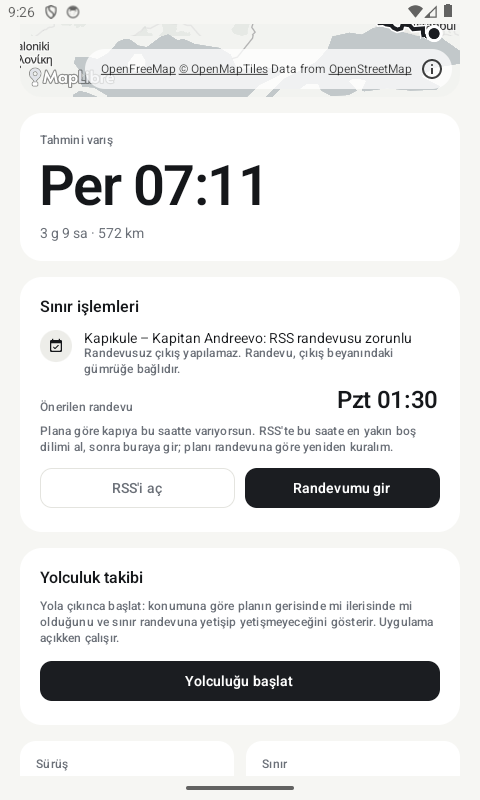 | 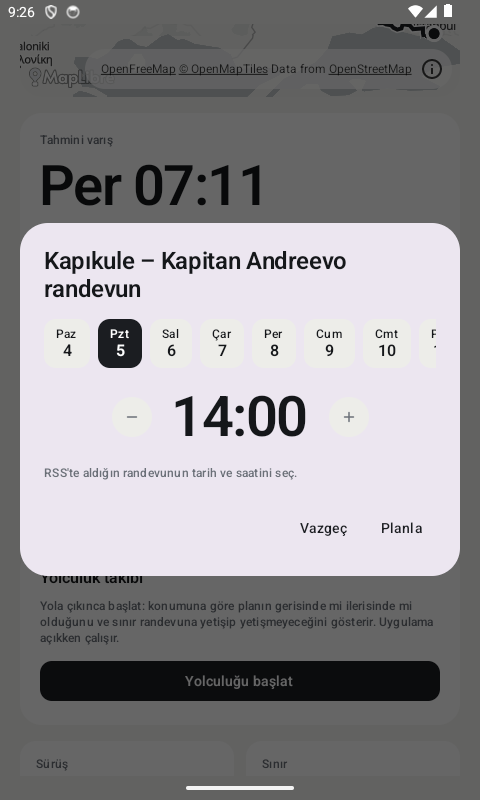 | 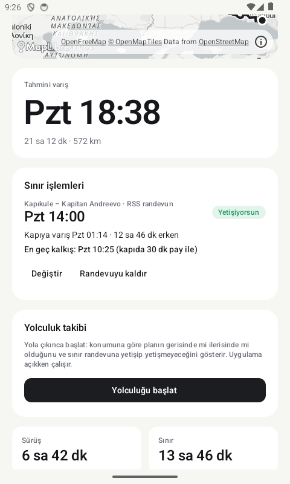 | 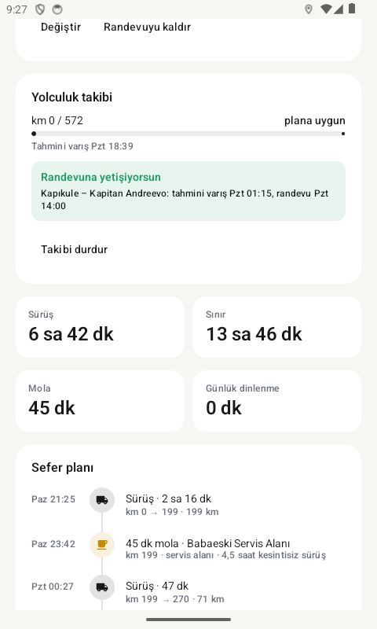 |
| Kapıkule çıkışında RSS zorunluluğu ve kapıya varışa göre önerilen randevu saati. | RSS'ten alınan gün ve saat girilir. | Yetişiyor / geç kalıyor, kapıya varış, en geç kalkış saati. | GPS ile plana göre ilerleme ve randevuya yetişip yetişmeyeceği. |

> Ekran görüntüleri Android emülatöründen, canlı UND verisi ve örnek şoför bildirimleriyle alınmıştır.

---

## Özellikler

### Sıra takibi
- **Kapı listesi ve harita:** Türkiye kapıları (Kapıkule, Hamzabeyli, İpsala, Gürbulak, Habur, Sarp, Türkgözü) ve
  koridor üzerindeki birkaç Balkan kapısı; çıkış / giriş yönü ayrı.
- **Detaylı sıra durumu:** bekleyen tır, kuyruk km, TIR parkı, son 24 saatte geçen tır, kuyruk trendi
  (saatte kaç tır artıyor / azalıyor), son 3 günün kuyruk grafiği.
- **Saat saat bekleme:** kapıya şimdi, 1 saat sonra … 12 saat sonra varırsan beklenen süre ve en kısa saat.
- **Şoför bildirimleri:** "sıradayım" (önümdeki tır sayısı) ve "geçtim" (toplam bekleme). Son 3 saatte geçen
  şoförlerin bildirdiği sürelerin ortancası resmi tahminin önüne geçer; resmi tahmin ayrıca gösterilir.
- **Şeffaflık:** her rakamın kaynağı, ne kadar eski olduğu, hesaplama yöntemi ve güven düzeyi ekranda.

### Rota planlama
- **Tır rotası:** Valhalla tır profili (yükseklik 4 m, ağırlık 40 t, dingil 11,5 t).
- **Kapı seçimi:** başlangıç ve varışı ayıran aday kapılar üzerinden ayrı rotalar; en erken varan seçilir,
  bekleme verisi eksik olanlar geride sıralanır. Katalogda olmayan kapılar OSM sınır noktalarından yakalanıp
  "bekleme verisi yok" olarak gösterilir.
- **Takograf:** molalar, günlük ve haftalık dinlenmeler kurallara göre; sınırdaki bekleme dinlenme sayılır.
- **Gerçek tesisler:** 8 ülkeden ~3.300 OSM tesisi (servis alanı, dinlenme alanı, tır parkı, tıra açık akaryakıt);
  mola sınırdan önceki son uygun tesise, gece dinlenmesi servis alanı ya da tır parkına çekilir.

### Sınır randevusu (RSS)
- Kapıkule çıkışında RSS zorunluluğu; Sarp / Türkgözü'nde Gürcistan TIR parkı zorunluluğu (80 GEL).
- Plana göre önerilen randevu saati ve RSS'e yönlendirme.
- Randevu girilince rota o kapıya sabitlenir; kapıya varış, erken / geç dakika ve **en geç kalkış** hesaplanır.
- Kalkışı ertelemek yoldaki dinlenmeyi evde yapmayı sağlıyorsa öneri ve tek dokunuşla yeniden plan.
- Uygulamadan RSS randevusu **alınamaz**: RSS'in dışa açık API'si yok. Ayrıntı: [docs/sira-kaydi.md](docs/sira-kaydi.md).

### Yolculuk takibi
- GPS konumu rotaya izdüşürülür; planın gerisinde / ilerisinde, tahmini varış, rotadan sapma.
- Randevuya geç kalınacaksa uyarı ve RSS'ten erteleme bağlantısı. Hesap telefonda, çevrimdışı çalışır.

---

## Veri kaynakları

| Kaynak | Ne veriyor | Sıklık | Durum |
|---|---|---|---|
| [UND – Sınır Kapıları Yoğunluk Durumu](https://www.und.org.tr/sinir-kapilari-yogunluk-durumu) | 9 kapı: ihracat kuyruğu (km), TIR parkı, günlük çıkış, ithalat kuyruğu | günde 1–2 rapor | **Kullanılıyor** (30 dk'da bir kontrol) |
| Şoför bildirimleri (uygulama) | Sıradaki tır sayısı, ölçülen bekleme | anlık | **Kullanılıyor** |
| [OpenStreetMap / Overpass](https://overpass-api.de) | Dinlenme tesisleri, tır parkları, sınır kontrol noktaları | günlük, disk önbellekli | **Kullanılıyor** |
| [Valhalla (FOSSGIS)](https://valhalla1.openstreetmap.de) | Tır rotası | istek başına | **Kullanılıyor** (geliştirme sunucusu) |
| [Photon (Komoot)](https://photon.komoot.io) | Yer arama | istek başına | **Kullanılıyor** (geliştirme sunucusu) |
| [OpenFreeMap](https://openfreemap.org) | Harita altlığı | – | **Kullanılıyor** |
| Ticaret Bakanlığı anlık saha yoğunluğu, Trakya GDTBM | Anlık bekleyen araç / günlük giriş-çıkış | anlık / günlük | Erişim kısıtlı veya yalnızca resim; değerlendiriliyor |
| [Nakordoni API](https://nakordoni.eu/en/developers) | AB kapıları kuyruk ve bekleme | ~9 dk | Değerlendiriliyor |

Ayrıntılı not: [docs/veri-kaynaklari.md](docs/veri-kaynaklari.md).

---

## Tahmin nasıl yapılıyor

**Resmi veriden** (`estimator.Queue`):

- bekleyen tır = kuyruk km × 55 (tır başına ~18 m) × şerit + TIR parkındaki tır
- bekleme = bekleyen tır ÷ (günlük geçiş ÷ 24)
- 12 saatten eski veri → güven düşük

**Şoför bildirimleriyle** (`estimator.WithReports`):

- Son 3 saatte "geçtim" bildirimi varsa bekleme = bildirilen sürelerin **ortancası** (tek hatalı bildirim sonucu
  bozmasın diye); 2+ bildirim → güven yüksek.
- Son 90 dakikada "sıradayım" bildirimi varsa bekleyen tır = önündeki tır sayılarının ortancası, süre = ÷ geçiş hızı.

**Trend ve saatlik görünüm** (`estimator.TrendOf`, `estimator.Outlook`):

- Trend: aynı kaynağın son iki gözlemi arasında saatte tır değişimi (±2'den fazlası büyüyor / azalıyor).
- Saatlik görünüm: mevcut kuyruk, trend (en fazla 6 saat ileri, kapının işleme hızından hızlı küçülemez) ve günlük
  geçiş hızından; ölçülmüş bekleme varsa ondan başlar.

Bu formüller başlangıç modelidir; aynı `port.Estimator` arayüzünün arkasına geçmiş veriyle eğitilmiş bir model
konulabilir.

---

## Takograf kuralları

`backend/internal/tacho` paketi saf mantıktır (I/O ve saat yok), testlerle sabitlenmiştir.

| Kural | Uygulama |
|---|---|
| 4 sa 30 dk kesintisiz sürüş | 45 dk mola ya da 15 + 30 bölünmüş mola |
| Günlük sürüş | 9 sa, haftada 2 gün 10 sa |
| Günlük dinlenme | 11 sa; iki haftalık dinlenme arasında 3 kez 9 sa |
| Görev penceresi | son dinlenmeden itibaren 13 sa (kısaltılmışta 15 sa) |
| Haftalık sürüş | takvim haftasında 56 sa, iki haftada 90 sa; dolunca yeni haftaya kadar dinlenme |
| Haftalık dinlenme | son haftalık dinlenmeden 6 × 24 sa sonra 45 sa |
| Sınırda bekleme | kapsadığı en uzun dinlenme sayılır (15 dk, mola, 9 / 11 sa) |
| Kalkışa kadar bekleme | dinlenme sayılır (`DriverState.AfterIdle`) |

Henüz yok: bölünmüş günlük dinlenme (3 + 9), kısaltılmış haftalık dinlenme (24 sa) ve telafisi, feribot / tren.

---

## Mimari

Clean architecture: bağımlılık yönü `adapter → usecase → port → domain`. İş kuralları hiçbir framework'e, veri
kaynağına ya da sunucuya bağlı değildir; her dış servis bir arayüzün arkasındadır ve değiştirilebilir.

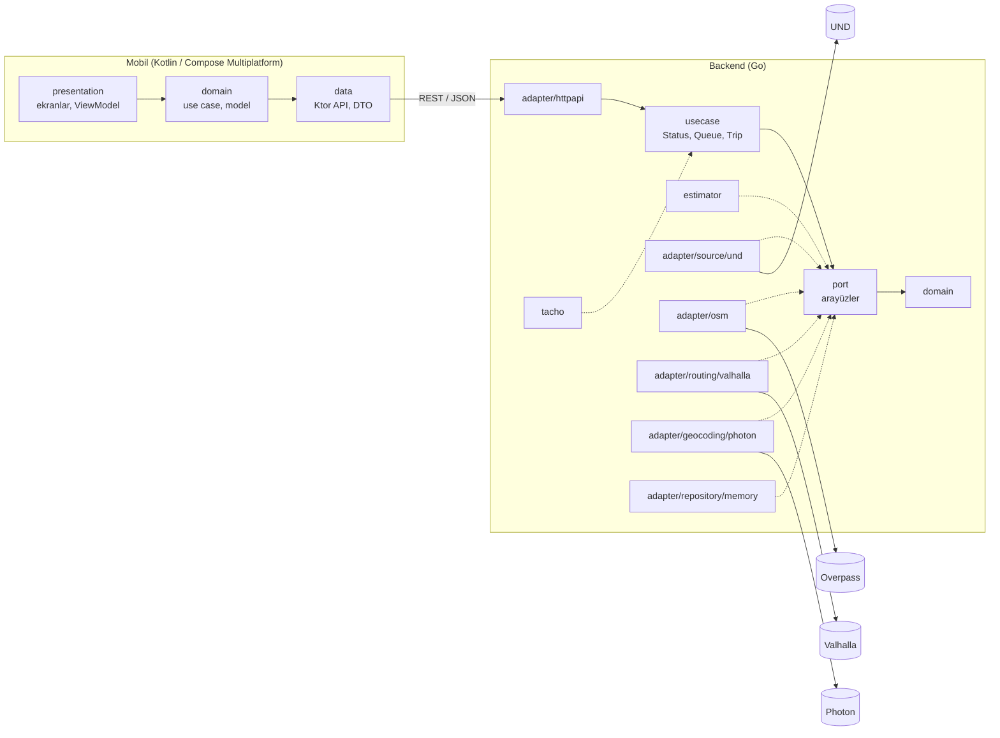

**Yeni veri kaynağı eklemek:** `port.SnapshotSource` (`ID`, `Interval`, `Fetch`) uygulanır ve
`backend/cmd/api/main.go` içinde kaydedilir. Kaynaklar birbirinden bağımsızdır; biri hata verirse diğerleri devam
eder. Rota motoru, yer arama, tesis ve sınır noktası verisi de aynı şekilde değiştirilebilir.

Ayrıntılı mimari: [docs/mimari.md](docs/mimari.md).

### Teknolojiler

| Katman | Teknoloji |
|---|---|
| Mobil | Kotlin 2.4, Compose Multiplatform 1.12, Ktor 3, kotlinx-serialization / datetime, Navigation, MapLibre Compose 0.18 |
| Android | AGP 9.4, minSdk 26, compileSdk 37 |
| iOS | SwiftUI kabuğu + Compose, iOS 16+ |
| Backend | Go 1.25, yalnızca standart kütüphane + `golang.org/x/net/html` |

---

## Kurulum ve çalıştırma

### Gereksinimler

- Go 1.25+
- JDK 17+ ve Android SDK (platform 37)
- Xcode 26+ (iOS için)

### Backend

```bash
cd backend && go run ./cmd/api
```

İlk açılışta UND verisi hemen, OSM tesis ve sınır noktası verisi (8 ülke) birkaç dakikada yüklenir ve
önbelleğe alınır; sonraki açılışlarda önbellekten anında gelir.

| Ortam değişkeni | Varsayılan | Açıklama |
|---|---|---|
| `PORT` | `8080` | HTTP portu |
| `VALHALLA_URL` | FOSSGIS public sunucusu | Tır rotası |
| `PHOTON_URL` | photon.komoot.io | Yer arama |
| `OVERPASS_URL` | overpass-api.de | OSM sorguları |
| `OSM_COUNTRIES` | `TR,GE,BG,GR,RS,AM,AZ,IR` | Tesis ve sınır noktası verisi alınacak ülkeler |
| `CACHE_DIR` | kullanıcı önbellek klasörü / `sinirdayim` | OSM disk önbelleği |

Testler:

```bash
cd backend && go test ./...
```

### Android

```bash
cd mobile && ./gradlew :androidApp:installDebug -PapiBaseUrl=http://10.0.2.2:8080
```

Emülatör ana makineye `10.0.2.2` üzerinden ulaşır; fiziksel cihazda Mac'in yerel IP adresi kullanılır.

Ortak kod testleri (JVM üzerinde):

```bash
cd mobile && ./gradlew :composeApp:testAndroidHostTest
```

### iOS

1. `mobile/iosApp/Local.xcconfig` oluştur (git'e girmez):
   ```
   API_BASE_URL = http:/$()/192.168.1.20:8080
   ```
   Simülatörde `localhost` yeterli; telefonda Mac ile aynı ağda olunmalı.
2. `mobile/iosApp/Config.xcconfig` içinde `TEAM_ID`'yi kendi Apple geliştirici ekibinle değiştir.
3. `mobile/iosApp/iosApp.xcodeproj`'yi Xcode'da aç ve çalıştır. Kotlin framework'ü derleme sırasında Gradle ile
   üretilir.

---

## API

| Uç nokta | Açıklama |
|---|---|
| `GET /v1/crossings` | Tüm kapılar, çıkış ve giriş tahminleri |
| `GET /v1/crossings/{id}?hours=48` | Tek kapı ve ham gözlem geçmişi |
| `GET /v1/crossings/{id}/queue` | Detaylı sıra: yön başına birleşik ve resmi tahmin, trend, 12 saatlik görünüm, kaynaklar, şoför bildirimleri, prosedürler |
| `POST /v1/crossings/{id}/reports` | Şoför bildirimi |
| `POST /v1/trips/plan` | Takografa uygun rota, sınır beklemeleri, alternatifler, randevu |
| `GET /v1/places?q=` | Yer arama |
| `GET /healthz` | Sağlık kontrolü |

<details>
<summary>Örnek: şoför bildirimi</summary>

```bash
curl -X POST localhost:8080/v1/crossings/tr-ge-sarp/reports \
  -H 'Content-Type: application/json' \
  -d '{"direction":"export","kind":"in_queue","vehiclesAhead":450,"note":"Kuyruk Kemalpaşa girişine kadar"}'

curl -X POST localhost:8080/v1/crossings/tr-ge-sarp/reports \
  -H 'Content-Type: application/json' \
  -d '{"direction":"export","kind":"passed","waitMinutes":1140}'
```
</details>

<details>
<summary>Örnek: RSS randevusuyla rota planı</summary>

```bash
curl -X POST localhost:8080/v1/trips/plan \
  -H 'Content-Type: application/json' \
  -d '{
    "origin": {"lat": 41.01, "lng": 28.97},
    "destination": {"lat": 42.70, "lng": 23.32},
    "departAt": "2026-10-04T21:00:00+03:00",
    "stateAt": "2026-10-04T21:00:00+03:00",
    "driver": {"continuousDrivingMin": 0, "dailyDrivingMin": 0, "reducedRestsLeft": 3},
    "appointment": {"crossingId": "tr-bg-kapikule", "at": "2026-10-05T14:00:00+03:00"}
  }'
```
</details>

---

## Proje yapısı

```
SinirdayimApp/
├── backend/                          Go
│   ├── cmd/api/                      bağımlılıkların bağlandığı yer, HTTP sunucusu
│   └── internal/
│       ├── domain/                   kapı, gözlem, tahmin, bildirim, rota, tesis
│       ├── port/                     arayüzler
│       ├── usecase/                  Status, Queue (sıra ve bildirim), Trip (rota, randevu)
│       ├── estimator/                bekleme, trend, saatlik görünüm, bildirim birleştirme
│       ├── tacho/                    takograf kuralları
│       ├── geo/                      mesafe, polyline
│       ├── catalog/                  kapı listesi ve prosedürler
│       └── adapter/                  und, osm, valhalla, photon, memory, httpapi
├── mobile/
│   ├── composeApp/                   ortak kod (Android + iOS)
│   │   └── src/commonMain/kotlin/com/sinirdayim/
│   │       ├── domain/               model, repository arayüzleri, use case'ler, yolculuk takibi
│   │       ├── data/                 Ktor API, DTO, eşleyiciler
│   │       ├── presentation/         ekranlar, tema, harita
│   │       └── di/                   AppContainer
│   ├── androidApp/                   Android giriş noktası
│   └── iosApp/                       SwiftUI kabuğu, Xcode projesi
└── docs/
    ├── mimari.md
    ├── veri-kaynaklari.md
    ├── sira-kaydi.md                 resmi sıra / randevu sistemleri araştırması
    └── images/                       README ekran görüntüleri
```

---

## Bilinen sınırlar

- **Veri saklama bellekte:** sunucu yeniden başlayınca gözlem geçmişi ve şoför bildirimleri silinir.
- **Resmi veri seyrek:** UND günde 1–2 rapor yayınlıyor; anlık durumu şoför bildirimleri tamamlıyor.
- **Bildirimlerde kötüye kullanım koruması yok:** kimlik, hız sınırı ve konum doğrulaması henüz eklenmedi.
- **Geliştirme sunucuları:** Valhalla, Photon ve Overpass'ın herkese açık sunucuları kullanılıyor; canlı kullanım
  için kendi sunucularımız gerekiyor.
- **Yolculuk takibi yalnızca uygulama açıkken** çalışıyor; arka plan konumu ve bildirim yok.
- **RSS randevusu uygulamadan alınamıyor** (dışa açık API yok).
- **Varsayımlar:** tır başına 18 m kuyruk, tek şerit, randevu sonrası 1 saat geçiş süresi.

## Yol haritası

- [ ] PostgreSQL: gözlem geçmişi ve bildirimlerin kalıcı saklanması; geçmişe dayalı saatlik desen
- [ ] Bildirimlerde kimlik, hız sınırı, kapı yakınında konum doğrulaması
- [ ] GPS ile otomatik bekleme ölçümü (kuyruk bölgesine giriş – kapıdan çıkış)
- [ ] Arka planda yolculuk takibi ve yerel bildirim
- [ ] RSS ve kapı işletmeleriyle resmi entegrasyon (iş geliştirme)
- [ ] Ek kaynaklar: Bakanlık anlık saha verisi, Bulgar Sınır Polisi, Nakordoni
- [ ] Kendi Valhalla / Overpass / harita sunucuları, tır odaklı harita stili
- [ ] Tesis bilgisi: doluluk, güvenlik, fiyat (kullanıcı bildirimi)

## Lisans

[MIT](LICENSE)
